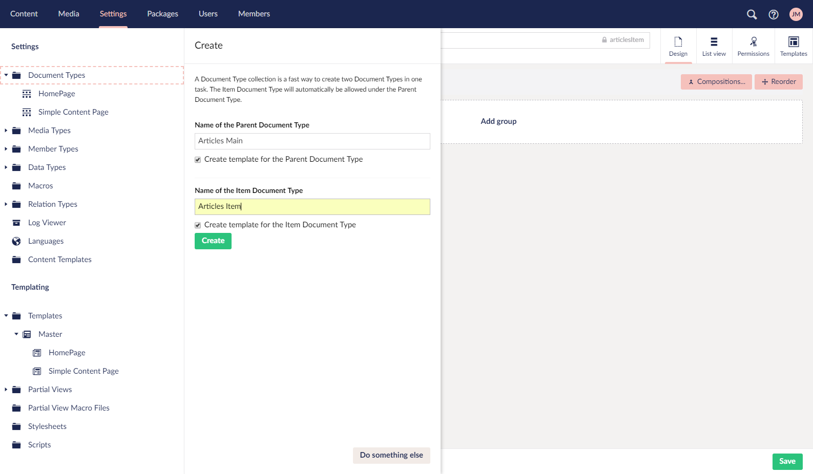
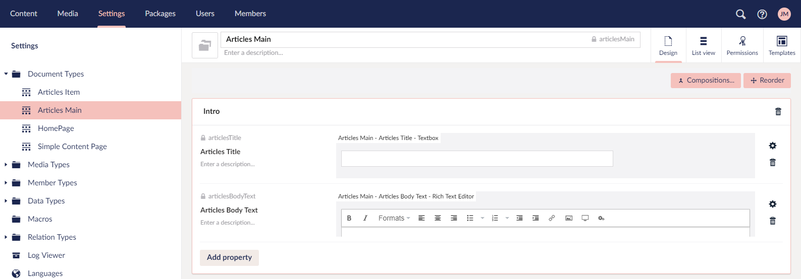
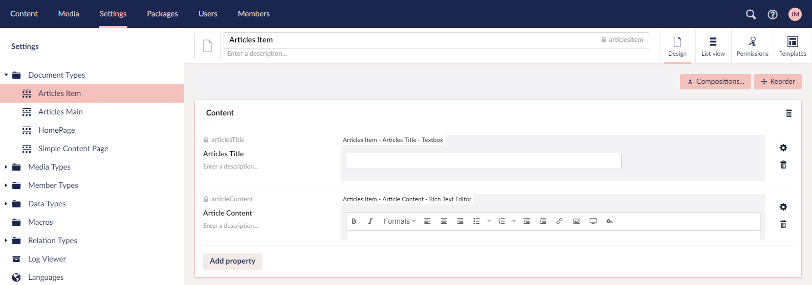
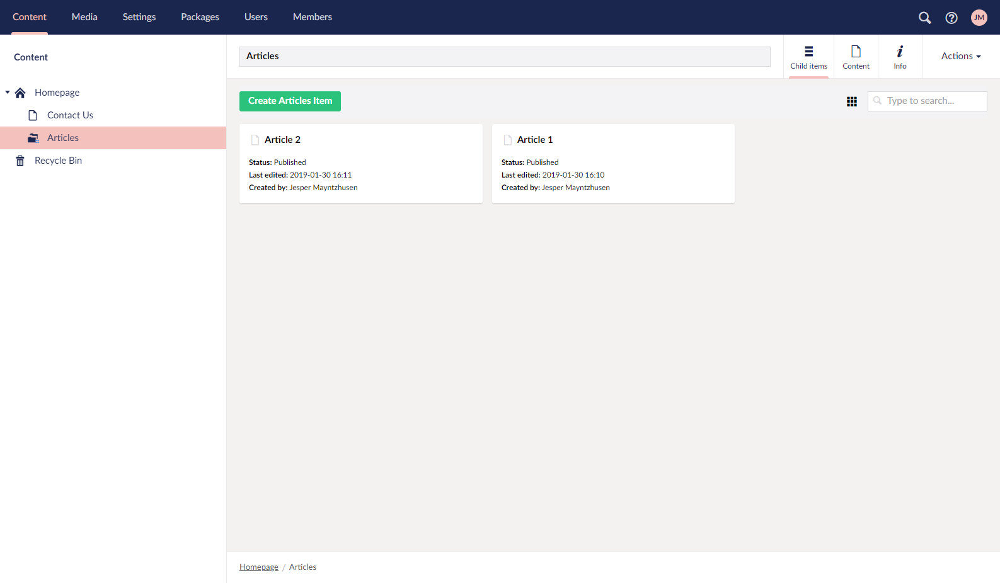
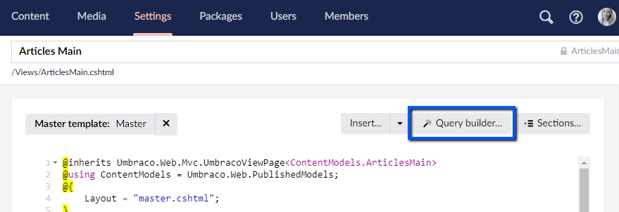
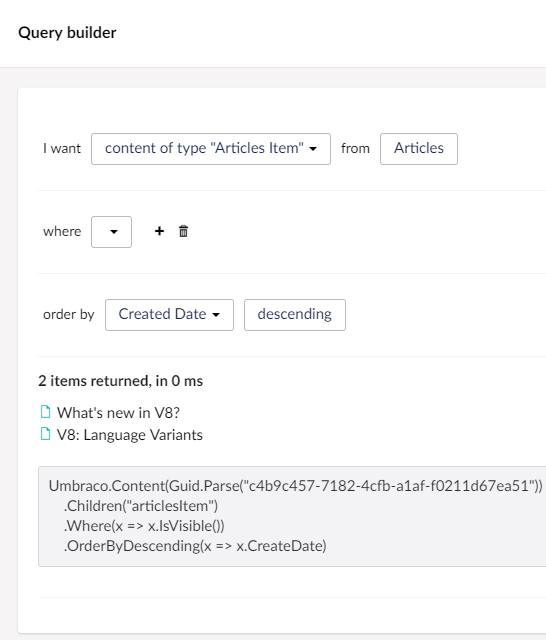
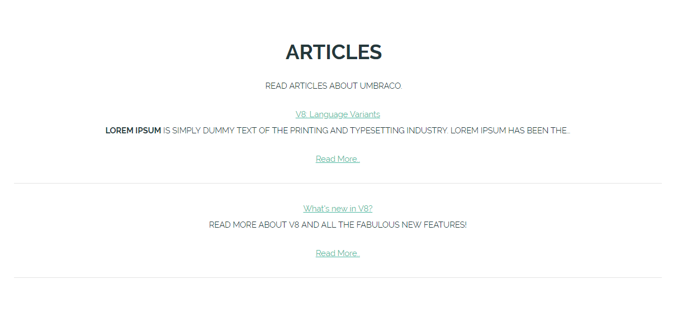

# Articles Parent and Article Items - A Parent Page with Infinite Children

Having an Articles Parent page, and a number of associated child articles which the editors can add to freely, provides a good example page of the power of Umbraco. We'll assume our fictional company, Widgets Ltd, write about ten articles a month and want the articles page to act like a blog (e.g. you could use this functionality for a blog or news and events pages).

For this you can create a **Document Type Collection**, go to **_Settings > Document Types > Create > Document Type Collection_** call the Parent Document Type `Articles Main` and the Child one `Articles Item`. 



Create the following **_Tabs_** and **_Data Properties_**:

#### Articles Main

>Group = Intro
>**"Articles Title"** - Type = Textbox
>**"Articles Body Text"** - Type = Rich Text Editor**



#### Articles Item
>Tab = Content
>**"Article Title"** - Type = TextBox
>**"Article Content"** - Type = Rich Text Editor**



Now go to the **_Settings > Document Types >Articles Main node > Permissions screen_** and you will notice that **_Articles Item_** has already been added as an allowed child node, this is because we created it as a Document Collection. 

This allows us to create items under the main (which acts as a parent container). We also need to allow the **_Articles Main node_** to be created under the **_Homepage node_** (do this in the **_Settings > Document Types > Homepage node > Permissions screen >  Allowed child node types_** - don't add the **_Articles Item_** - only the main should be allowed at this level). 

Now go to **_Content > Homepage node (hover)> ..._** and create a node called "_Articles_" of type **_Articles Main_** (if you don't have this option go back and check your allowed child nodes - did you forget to click **_Save_**)?  Give the Articles node some content and a title. 

When you click save you will notice that it has been created as a list view, this means that child nodes are automatically in a list to make it easier to see them, you can create new nodes from this section too, go ahead and create a few.

Now you should have a content tree that looks like the image below (obviously with your own page node names).  Let's go update our templates we just created (automatically when we created the Document Types). First, update them to use the Master as a parent **_Settings > Templates > Articles Main node > Master template_** = "Master" - do the same for the Articles Item remembering to click **_Save_**. 



Copy the template content from the **_Simple Content Page_**  template and paste this into both the Articles Item and Articles Main (you may need to refresh the nodes again to see these. Set the Master template to be "Master" and then replace the Page field tags with the relevant  properties e.g. **_articlesTitle_** and **_articlesBodyText_** for the **_Articles Main_** and the **_articleTitle_** and **_articleContent_** for **_Article Item_**. 

:::warn
Take care when copying not to overwrite the first line `@inherits Umbraco.Web.Mvc.UmbracoTemplatePage<ContentModels.ArticlesMain>` - if you get an exception when loading the page about not being able to bind to source ensure the last part in < > brackets matches your Document Type Alias. 
:::

If we now go and check our Articles Main page in the browser we should see our content. We'd like to list the child article items under the intro content so that our visitors can see a list of our articles. Umbraco makes this easy for us but we need to use a bit of Razor.

Click on the **_Settings_** menu from the top menu, and navigate to the **_Articles Main_** template.

We are going to use Razor to query between all instances of **_Article Item_** under the **_Article Main_** content node. In order to do that, we are going to use the built-in **Query Builder**.



There are a few parameters we need to consider, when creating a query like that.

First of all, we need to tell the Query builder **what** we want from **where**. You will also be able to set some conditions to get specific items, and you can decide in which order you will like the items served. For the purpose of this guide, we'll use the following parameters:



If you've set the correct parameters, you will get a preview of the items being selected with the query. When you're happy with the parameters, click **Submit**, and you will see a code snippet has been added to your template. 

It will look similar to this:

```csharp
@{
    var selection = Umbraco.Content(Guid.Parse("c4b9c457-7182-4cfb-a1af-f0211d67ea51"))
    .Children("articlesItem")
    .Where(x => x.IsVisible())
    .OrderByDescending(x => x.CreateDate);
}
<ul>
    @foreach (var item in selection)
    {
        <li>
            <a href="@item.Url">@item.Name</a>
        </li>
    }
</ul>
```

This code will output a list of all the **_Article Items_** as links using the name. We are going to modify this a little, to add a bit more information about the articles. Replace the `HTML` in the *foreach* loop with this snippet:

```csharp
<div class="article">
    <div class="articletitle"><a href="@item.Url">@item.Name</a></div>
    <div class="articlepreview">@item.Value("articleContent").ToString().Truncate(100) <a href="@item.Url">Read More..</a></div>
</div>
<hr/>
```

Now check this in the browser!



---
## Next - [Adding Language Variants](../Adding-Language-Variants.md)
At this point we have a basic site, but wouldn't it be cool if we could make the same site in another language? Read on to see how easy it is with Language Variants!

